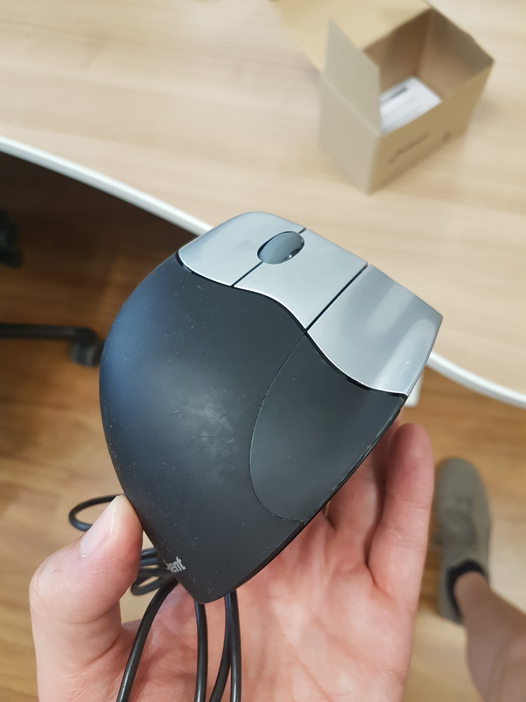
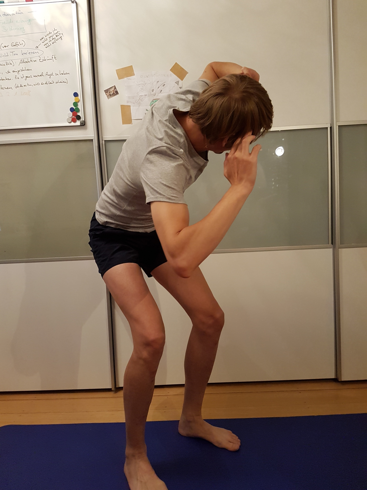

<!-- .slide: data-state="no-toc-progress" --> <!-- don't show toc progress bar on this slide -->

# Tatort Schreibtisch
<!-- .element: class="no-toc-progress" --> <!-- slide not in toc progress bar -->

## Rücken- und andere Leiden lindern

created by [theno](https://github.com/theno) | 2018-09-11 | [online][1] | [src][2] | [1page][3]


[1]: https://theno.github.io/presi-nacken
[2]: https://github.com/theno/presi-nacken
[3]: https://github.com/theno/presi-nacken/blob/master/slides.md

----  ----

<!-- .slide: data-state="no-toc-progress" --> <!-- don't show toc progress bar on this slide -->

### Bin kein Experte: Alles hier kann falsch sein!
<!-- .element: class="no-toc-progress" -->

* Selber Hirn einschalten
* Selber Ärztin konsultieren (Orthopäde)
* Selber auf seinen Körper achten und "hören"

---

Habe mich damit auseinander gesetzt wegen Reha wegen Beinbruch

----  ----

# Übung an der Wand

----

## Übung an der Wand

__Kräftigungsübung__

Ziel:  
_Die Wirbelsäule von unten her aufrichten_

---

<div class="fragment" />

Geht immer und überall, wo es eine Wand
(Bushaltestelle, Straßenschild, Baum, irgendwas zum Anlehnen) gibt

----

## [Übung an der Wand](https://youtu.be/XJYy6goJSXo#t=32s)
* Das Becken nach hinten kippen: *Mit dem Bauchnabel die Lendenwirbelsäule
  nach hinten an die Wand drücken*
* *Pomuskulatur anspannen*
* Beine gerade halten: *Oberschenkel anspannen*
* Stets Kontakt der Lendenwirbelsäule zur Wand halten

---

<div class="fragment" />

 * fünf mal je
   * fünf Atemzüge lang (30 Sekunden).
   * zwei Atemzüge (10 Sekunden) Pause dazwischen

---

<div class="fragment" />

 * das Ganze sieben mal am Tag machen  
   (7 Einheiten je 5 Sätze [30-10-30-10-30-10-30-10-30])

----

### Übung an der Wand

<!-- .slide: data-state="no-toc-progress" --> <!-- don't show toc progress bar on this slide -->


----

## Übung an der Wand

Sieben mal am Tag, zum Beispiel:

1. morgens direkt nach dem Aufstehen

2. als erstes auf Arbeit

3. Beginn Mittagspause

4. Ende Mittagspause

5. zum Feierabend

6. abends zuhause

7. vor dem Schlafengehen

----

## Übung an der Wand

* Selbstkontrolle -> Übung vorm Spiegel machen / *nackich*

* Spitzenmäßige Ergänzungen:

  * Hüftbeuger ist oft verkürzt: Gezielt dehnen

  * Pomuskel is oft verkümmert:
    Kniebeugen sind der Hit!

----

## Übung an der Wand (ÜadW)

* Beherrschst du die ÜadW gut *-- aber erst dann --* kannst
  du dich auch nach oben hin weiter aufrichten:
  * Schultern nach hinten
  * Brustbein (Sternum) aufrichten /  
    Schulterblätter zusammen
  * Halswirbel aufrichten -> Doppelkinn machen
  * dabei die (Bauch-Beine-Po-) Muskel-Anspannungen der Grundübung
    nicht vernachlässigen!

* Mit der Zeit kann die Häufigkeit auf bis zu zweimal am Tag (morgens,
  abends) reduziert werden.

----

## Übung an der Wand

 * SAT.1
   * [Tipps vom Experten: Das können Sie gegen Rückenschmerzen tun](https://www.sat1regional.de/tipps-vom-experten-das-koennen-sie-gegen-rueckenschmerzen-tun/)
   * [Chronische Rückenschmerzen: 75.000 Betroffene in Hamburg](https://www.sat1regional.de/chronische-rueckenschmerzen-75-000-betroffene-in-hamburg/)
 * N3-Visite:
   * [Interview: Spinalkanalstenose](https://youtu.be/XJYy6goJSXo)
   * [Spinalkanalstenose: Übungen statt Operation](https://youtu.be/tgyTX-OIeOw)
  * [Übungen Rückenschmerzen](https://youtu.be/xzNBqBGp1dE)
   * [Powerplate: Vibrationen für Fitness und Reha](https://youtu.be/uHnnGibjL9w)
  * [Vorsicht bei Nahrungsergänzungsmitteln](https://youtu.be/SiUVJdVVCUU)


----  ----

# Wirbel um Knorpel

----

## Knorpel

----

### Knorpel

 * benötigt Druck sowie Entspannung
   * Nährstoffversorgung: "Schwamm-Prinzip"
     * Ruhephasen deshalb wichtig
       * z.B. im Liegen schlafen
     * Gelenke belasten deshalb wichtig
       * z.B. gehen

 * Knorpel wächst nicht nach / Schäden irreversibel
   * bis hin zur Athrose (Knorpel ganz weg)

----

## Wirbelsäule

----

<!-- .slide: data-state="no-toc-progress" --> <!-- don't show toc progress bar on this slide -->

### Wirbelsäule

</img>

----

<!-- .slide: data-state="no-toc-progress" --> <!-- don't show toc progress bar on this slide -->

### Bandscheibenvorfall

</img>

----  ----

# Vorm Rechner Sitzen

----

## Verformungsbild

---

<div class="fragment" />

* Hals nach vorne geneigt
* Rundrücken
* verkürzter Hüftbeuger: Hüfte vorgekippt
* Hohlkreuz

-> anhaltende, einseitige Belastung

----

## Typische Probleme

* Halswirbel-Schmerzen
* Nackenschmerzen
* Schmerzen im Lendenbereich
* Knieschmerzen
* Karpaltunnelsyndrom

Fehlhaltung bedeutet übermäßige Belastung einzelner Körperteile

----

## Typische Probleme -- Eskalation

* Bandscheibenprobs
  - Vorwölbungen
  - Bandscheibenvorfälle

* Knorpelschaden (etwa im Knie)
  - immer irreversibel
  - maximal Athrose

----

## Typische Fehlhaltungen und Ausweichbewegungen

Suchmaschienen-Schlagwörter:

* OSG: Fehlender Initial Contact. Abrollphase verringert
* KG: Fehlende KG Ext., Fehlender Initial Contact
* HG: Duchenne, Trendelenburg
* SG: Protraktion, Elevation über BWS Ext.

----

## Motivation

Mit der Zeit geht alles schlimmer -> irreversibel

---

### Die gute Nachricht:

<div class="fragment" />

 * Selber was tun hilft
   * artgerechte Körperverwendung
     * sitzen optimieren
     * ausgleichen durch Übungen
   * bei allen Eskalationsstufen!

----

## Welche Sitzposition ist die beste?

<div class="fragment" />

Die Nächste!

---

<div class="fragment" />

Zauberformel: **Dynamisches Sitzen**

----

## Geschäft mit dem Schmerz

Es gibt so viel Zeugs zu kaufen

Diese können wirklich was bringen:
* guter Stuhl und Tisch
* Hochkant-Maus
* ggf. Fußablage um die Lenden zu entlasten

----

</img>


----  ----

# Stress

----

## Stress + Sitzen => Schmerzen

Unter Stress: **verkrampfte Haltung**
  * unergonomisch
  * anhaltend, einseitig

----

## Stressampel


----

## Motivation

**Positiver Stress (Eustress)**  

*--wird-auf-Dauer-zu-->*  

**Dauerhaft Negativer Stress (Disstress)**

---

<div class="fragment" />

Ziel:

**Anhaltenden Stress vermeiden**

---

<div class="fragment" />

*Was kann ich denn tun?*

----

## Stressreaktion

Stress will körperlich abgebaut werden ->
im Büro eine Herausforderung

* Stress-Situationen erkennen und Stress bewusst abbauen:
   * Achtsamkeitsübungen:
     * auf genau eine Sache konzentrieren  
       (Stress bedeutet mehrere Dinge zugleich zu machen)
     * Körper "durchfühlen"
   * 2 Minuten lang:  
     4 Sekunden einatmen, 6 Sekunden ausatmen
   * Telefonbuch anschaffen: Bei Stress versuchen, es zu zerreissen

----

## Persönliche Stressverstärker

### Stressverstärkende Gedanken

Beispiele

----

### Stresstyp

Innere Stimme:
* __*Sei perfekt!*__
* __*Sei beliebt!*__
* __*Sei stark!*__
* __*Sei auf der Hut!*__
* __*Ich kann nicht!*__

[mehr dazu](http://s514319074.online.de/pfiff2/pdf/Infoblatt_5_Stressverst+%A4rker_und_was_dahinter_steckt.pdf)

----

### *Sei perfekt!*

* Überhöhter Wunsch:
  * Erfolg
  * Selbstbestätigung
  * Anerkennung durch andere

* Strategie: mehr leisten

* Angst vor:
  * Misserfolg
  * Versagen
  * Eigene Fehler

* Ursache: Vermindertes Selbstwertgefühl (Narzissmus)

----

<!-- .slide: data-state="no-toc-progress" --> <!-- don't show toc progress bar on this slide -->

### *Sei beliebt!*

* Überhöhter Wunsch nach:
  * Zugehörigkeit
  * Angenommensein
  * Liebe

* Motto: Eigene Bedürfnisse zurückstellen

* Angst vor:
  * Ablehnung
  * Kritik
  * Zurückweisung

* Depressive Persönlichkeit  
  (nach Fritz Riemann - Grundformen der Angst)

----

### *Sei stark!*

* Überhöhter Wunsch nach:
  * Persönliche Unabhängigkeit
  * Selbstbestimmung

* Motto: Alles selber machen

* Angst vor:
  * Abhängigkeit von anderen
  * Eigene Hilfsbedürftigkeit
  * Schwäche

* Schizoide Persönlichkeit

----

### *Sei auf der Hut!*

* Überhöhter Wunsch nach:
  * Sicherheit
  * Kontrolle

* Motto: Bloß nichts verändern

* Angst vor:
  * Kontrollverlust
  * Fehlentscheidungen
  * Scheu vor Risiken

* Zwanghafte Persönlichkeit

----

### *Ich kann nicht!*

* Überhöhter Wunsch nach:
  * Eigenes Wohlbefinden
  * Bequemes Leben

* Geringe Frustrationstoleranz

* Angst vor:
  * Unangenehme Gefühle
  * Anstrengung
  * Gefühl der Hilflosigkeit

* Hysterische Persönlichkeit

----

### *Sei perfekt* - Stresslindernde Gedanken

* Auch ich darf Fehler machen
* Aus Fehlern werd ich klug
* Oft ist gut gut genug
* Weniger ist manchmal mehr
* So gut wie möglich, so gut wie nötig
* Ab und zu lasse ich fünf gerade sein
* Ich gebe mein Bestes und achte auf mich
* Ich unterscheide zwischen wichtig und unwichtig
* Nichts wird so heiß gegessen, wie es gekocht wird

----

### *Sei beliebt* - Stresslindernde Gedanken

* Ich darf "Nein" sagen
* Ich achte auf meine Grenzen, meine Bedürfnisse
* Ich sorge auch für mich
* Ich bin gut zu mir
* Ich darf andere enttäuschen
* Ich kann/will/muss es nicht allen recht machen
* Nicht alle anderen müssen mich mögen
* Kritik gehört dazu
* Ich darf kritisieren, meine Meinung sagen
* Ich darf kritisiert werden

----

### *Sei stark* - Stresslindernde Gedanken

* Ich darf auch mal Schwäche zeigen
* Schwächen sind menschlich
* Ich darf um Hilfe/Unterstützung bitten
* Es gibt Hilfe/Unterstützung für mich
* Ich gebe anderen die Chance, mich zu unterstützen
* Ich lasse mich unterstützen
* Ich darf/kann delegieren
* Ich darf meine Gefühle zeigen
* Ich muss nicht alles selbst/allein machen

----

## Mit Stress umgehen

Eisenhower-Matrix über Dinge die zu tun sind

```
     Wichtigkeit
          ^
          |  +-------------------------------------+
          |  |      B / II      |      A / I       |
 wichtig  |  |                  |                  |
          |  |   planen und     |     sofort       |
          |  | selber erledigen |    erledigen     |
          |  +-------------------------------------+
          |  |      D / IV      |      C / III     |
 nicht    |  |                  |                  |
 wichtig  |  |   nicht machen   |    delegieren    |
          |  |                  |                  |
          |  +-------------------------------------+
          |
          +-------------------------------------------> Dringlichkeit
```

* Komforzone
* Strategien Stress zu mindern

----

## Mit Stress umgehen

Es gibt kein einfaches Rezept!

<div class="fragment" />

> Change it, love it or leave it.


----  ----

# Bürosport

----

Ziel:

Einseitige Belastungen ausgleichen und ihnen entgegenwirken

----

## Ohne Thera-Band

----

<!-- .slide: data-state="no-toc-progress" --> <!-- don't show toc progress bar on this slide -->

### Zur Seite drehen

</img>
</img>

</img>
</img>

----

<!-- .slide: data-state="no-toc-progress" --> <!-- don't show toc progress bar on this slide -->

### Arme nach vorne und hinten

</img>
</img>

</img>
</img>

----

<!-- .slide: data-state="no-toc-progress" --> <!-- don't show toc progress bar on this slide -->

### Kniebeuge

</img>
</img>

</img>
</img>

----

<!-- .slide: data-state="no-toc-progress" --> <!-- don't show toc progress bar on this slide -->

### Zur Seite "boxen"

</img>
</img>

</img>
</img>

----

<!-- .slide: data-state="no-toc-progress" --> <!-- don't show toc progress bar on this slide -->

### Dips

</img>
</img>

</img>
</img>

----

<!-- .slide: data-state="no-toc-progress" --> <!-- don't show toc progress bar on this slide -->

### lang machen

</img>
</img>

</img>

----

<!-- .slide: data-state="no-toc-progress" --> <!-- don't show toc progress bar on this slide -->

### Hüftbeuger dehnen

</img>
</img>

----

<!-- .slide: data-state="no-toc-progress" --> <!-- don't show toc progress bar on this slide -->

### Brustmuskel dehnen

</img>
</img>

----

<!-- .slide: data-state="no-toc-progress" --> <!-- don't show toc progress bar on this slide -->

### Handgelenk dehnen

</img>

----

<!-- .slide: data-state="no-toc-progress" --> <!-- don't show toc progress bar on this slide -->

### Rücken mobilisieren

</img>
</img>

----

<!-- .slide: data-state="no-toc-progress" --> <!-- don't show toc progress bar on this slide -->

### Nackenseite dehnen

</img>
</img>

----

<!-- .slide: data-state="no-toc-progress" --> <!-- don't show toc progress bar on this slide -->

### Po dehnen

</img>

----

## Mit Thera-Band

----  ----

# Weitere Übungen

----

Ziel: Insgesamt Körper aufrichten Aufrichten

* Hohlkreuz
* Nacken- und Schulterbereich
* Hals
* Popo stärken

----

Werkzeuge:
 * Thera-Band
 * Balance-Kissen
 * Matte
 * Gürtel
 * Tennisball

----  ----

# Best Practice

----

täglich:

* dehnen
* den Körper aufrichtende Kraftübungen
* Ausdauersport

<div class="fragment" />

*eine __Morgenroutine__ wäre optimal*

----

## Strategie für Nachhaltige Umstellung

<div class="fragment" />

* Nicht alles auf einmal ändern

sondern:

<div class="fragment" />

* Neues zu **Gewohnheiten** machen

---

<div class="fragment" />

Gewohnheiten werden _automatisch_ gemacht; ohne groß darüber
nachzudenken, sich zu überwinden

----

## Motivation halten

* Vision: **Attraktive Zukunft**
  * _-> Beispiel: keine Nackenschmerzen_
  * Umkehrschluss:  
    Negative Konsequenzen bei Unterlassen  
    -> Beispiel (positiv gemünzt):  
    _Ich vermeide irreversible Knorpelschäden_

* Übungen mit **Freude** machen
  * _-> Fokus auf: **"Die Übungen tun mir gut"**_

----

## Marathon statt Strohfeuer

**
dran bleiben
**

* Gewohnheiten gemächlich einführen  
  Bit by Bit, nicht 64 Byte auf einmal
```
    Stück für Stück -- bit by bit
```
* Pausen sind okay  
  => wieder einsteigen ohne Schuldgefühl

* mal weniger Übungen machen

**
die Einstellung zählt
**

----

## Yet another Schweinehundtrick

Aufsagen:

> 3..2..1..los!

_und tun_

----

> Das bringt doch alles bei mir nichts..

..positiv denken lernen könnte weiterhelfen: https://urbestself.de/

----  ----

<!-- .slide: data-state="no-toc-progress" --> <!-- don't show toc progress bar on this slide -->

### *Vielen Dank für Eure Aufmerksamkeit!*
<!-- .element: class="no-toc-progress" -->


