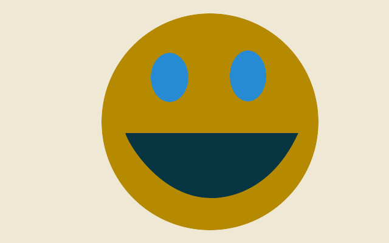

<!-- .slide: data-state="no-toc-progress" --> <!-- don't show toc progress bar on this slide -->

# Schreibtischtäter
<!-- .element: class="no-toc-progress" --> <!-- slide not in toc progress bar -->

## Rücken- und andere Leiden lindern

created by [theno](https://github.com/theno) | 2018-07-17 | [online][1] | [src][2]

[1]: https://theno.github.io/presi-nacken
[2]: https://github.com/theno/presi-nacken

----  ----

<!-- .slide: data-state="no-toc-progress" --> <!-- don't show toc progress bar on this slide -->

### Bin kein Experte: Alles hier kann falsch sein!
<!-- .element: class="no-toc-progress" -->

* Selber Hirn einschalten
* Selber Ärztin konsultieren (Orthopäde)
* Selber auf seinen Körper achten und "hören"

---

Habe mich damit auseinander gesetzt wegen Reha wegen Beinbruch

----  ----

# Übung an der Wand

----

## [Übung an der Wand](https://www.youtube.com/watch?v=hI_cR2jqHZc#t=32s)

* mit dem Bauchnabel die Lendenwirbelsäule nach hinten an die Wand
  drücken
* Pomuskulatur anspannen
* Oberschenkelmuskel anspannen
* Alles ohne den Kontakt der LWS zur Wand zu verlieren

Übung an der Wand fünf mal je fünf Atemzüge lang (30 Sekunden).
Zwei Atemzüge (10 Sekunden) Pause dazwischen.

Das Ganze sieben mal am Tag machen. (7 Einheiten je 5 Sätze 30-10-30...)

----

## Übung an der Wand

 * SAT.1
   * [Tipps vom Experten: Das können Sie gegen Rückenschmerzen tun](https://www.sat1regional.de/tipps-vom-experten-das-koennen-sie-gegen-rueckenschmerzen-tun/)
   * [Chronische Rückenschmerzen: 75.000 Betroffene in Hamburg](https://www.sat1regional.de/chronische-rueckenschmerzen-75-000-betroffene-in-hamburg/)
 * N3-Visite:
   * [Interview: Spinalkanalstenose](https://www.youtube.com/watch?v=hI_cR2jqHZc)
   * [Spinalkanalstenose: Übungen statt Operation](https://www.youtube.com/watch?v=kVfuXl1fFSw)
   * [Übungen Rückenschmerzen](https://www.youtube.com/watch?v=xzNBqBGp1dE)
   * [Powerplate: Vibrationen für Fitness und Reha](https://www.youtube.com/watch?v=uHnnGibjL9w)
   * [Vorsicht bei Nahrungsergänzungsmitteln](https://www.youtube.com/watch?v=SiUVJdVVCUU)

----

## Übung an der Wand

Sieben mal am Tag, zum Beispiel:

1. morgens direkt nach dem Aufstehen

2. als erstes auf Arbeit

3. Beginn Mittagspause

4. Ende Mittagspause

5. zum Feierabend

6. abends zuhause

7. vor dem Schlafengehen

----

## Übung an der Wand

* Beherrschst du das gut -- aber erst dann -- kannst du dich auch
  nach oben hin weiter aufrichten:
  * Brustbein (Sternum) aufrichten
  * Schultern nach hinten
  * Halswirbel aufrichten -> Doppelkinn machen
  * dabei die (Bauch-Beine-Po-) Muskel-Anspannungen der Grundübung
    nicht vernachlässigen!

* Selbstkontrolle -> Übung vorm Spiegel machen

* Mit der Zeit kann die Häufigkeit auf bis zu zweimal am Tag (morgens,
  abends) reduziert werden.

----  ----

# Wirbel um Knorpel

----

## Knorpel

----

Knorpelschäden bis hin zur Athrose

----

## Wirbelsäule

----

Bandscheibenvorfälle

----  ----

# Vorm Rechner Sitzen

----

Einseitige Belastung

----

Typische Probleme:

* Halswirbel-Schmerzen
* Nackenschmerzen
* Schmerzen im Lendenbereich
* Knieschmerzen
* Karpaltunnelsyndrom

----

Verformungsbild:

* verkürzter Hüftbeuger: Hüfte vorgekippt
* Hohlkreuz
* Rundrücken
* Hals nach vorne geneigt

----

Fehlhaltung bedeutet übermäßige Belastung einzelner Körperteile

----

Motivation:

Mit der Zeit geht alles schlimmer -> irreversibel

----

Wegen Fehlhaltung typische Probleme:

* Bandscheibenprobs
  - Vorwölbungen
  - Bandscheibenvorfälle

* Knorpelschaden (etwa im Knie)
  - immer irreversibel
  - maximal Athrose

----

Welche Sitzposition ist die beste?

Die Nächste

----

## Geschäft mit dem Schmerz

Es gibt so viel Zeugs zu kaufen

Diese können wirklich was bringen:
* guter Stuhl und Tisch
* Hochkant-Maus
* ggf. Fußablage um die Lenden zu entlasten

----  ----

# Stress

----

## Stressampel

* Stressoren <--> Persönlich Stressverstärker --> Stressreaktion
* langfristig --> Erschöpfung, Krankheit

----

----

## Äußere Stressfaktoren

* Leistungsanforderungen
* Zu viel Arbeit
* Soziale Konflikte
* Zeitdruck
* Störungen im Arbeitsfluss

----

## Innere Stressoren

* Ungeduld
* Perfektionismus
* Kontrollstreben
* Einzelkämpfertum
* Selbstüberforderung

----

## Was Stress auslöst

* Körperliche Aktivierung
* Emotionale Aktivierung
* Mentale Aktivierung
* Verhaltens-Aktivierung

----

## Mit Stress umgehen

* Eisenhower-Matrix
* Komforzone
* Strategien Stress zu mindern

----  ----

# Bürosport

----

Ziel:

Einseitige Belastungen ausgleichen und ihnen entgegenwirken

----

## Ohne Thera-Band

----

## Mit Thera-Band

----  ----

# Weitere Übungen

----

Ziel: Insgesamt Körper aufrichten Aufrichten

* Hohlkreuz
* Nacken- und Schulterbereich
* Hals
* Popo stärken

----

Werkzeuge:
 * Thera-Band
 * Balance-Kissen
 * Matte
 * Gürtel
 * Tennisball

----  ----

# Übungen

----  ----

# Best Practice

----

Täglich:

* Dehnen
* Spezifische Kraftübungen
* Ausdauersport

*eine Morgenroutine wäre optimal*

----

## Strategie für Nachhaltige Umstellung

* Nicht alles auf einmal ändern, sondern:
* Neues zu Gewohnheiten machen

----

## Marathon statt Strohfeuer

* Gewohnheiten gemächlich einführen
* Bit by Bit, nicht 64 Byte auf einmal

* dran bleiben, dennoch
* Pausen sind okay -> wieder einsteigen ohne Schuldgefühl
* die Einstellung zählt

----

> Das bringt doch alles bei mir nichts..

..positiv denken lernen könnte weiterhelfen: https://urbestself.de/

----  ----

<!-- .slide: data-state="no-toc-progress" --> <!-- don't show toc progress bar on this slide -->

### *Thank You for Your attention!*
<!-- .element: class="no-toc-progress" -->

